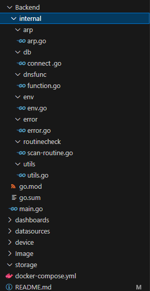
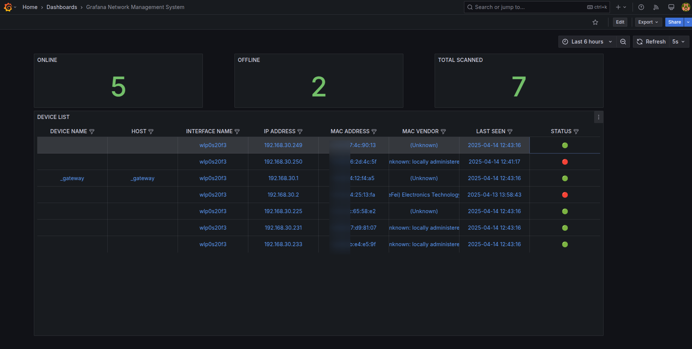

# Grafana Network Monitoring System
Grafana Network Monitoring System is a lightweight network monitoring tool that scans devices connected to your Local Area Network (LAN) and displays their online/offline status in real-time using Grafana dashboards.



Note: Before running this project, make sure to update the project structure and file paths (especially the database path in db/connect.go) according to your local environment.

Database Path Configuration

By default, the database is located at:
``` file:/home/user/Desktop/workspace/grafana/grafana-NMS/device/device.db```

This path is hardcoded in the **ConnectDB()** function inside **db/connect.go**:

```db, err := sqlx.Open("sqlite", "file:/home/user/Desktop/workspace/grafana/grafana-NMS/db/device.db?mode=rw")```

🔧 To run the project on your machine, make sure to update this path in connect.go to reflect your local environment. For example:

```db, err := sqlx.Open("sqlite", "file:/your/local/path/to/db/device.db?mode=rw")```

🌐 Network Interface Configuration

The project scans a specific network interface defined in the environment variable IFACES.

This logic is handled in env/env.go:

```func GetEnv() string {
	envVar := os.Getenv("IFACES")
	if envVar == "" {
		envVar = "eth0"
	}
	return envVar
}
```
By default, the interface is set to eth0.
If your system uses a different interface (like wlan0 or enp3s0), you should set the IFACES environment variable before running the project.

First start the Backend code by running main.go first
``` go run main.go```

🐳 Start the services with Docker Compose

Once you've configured the project, run the following command from the project root:

```docker compose up```

📊 Access Grafana

After the services are up and running, open your browser and navigate to:

```http://localhost:3000```

* Username: admin
* Password: admin


### 📘 Grafana Dashboard Overview

